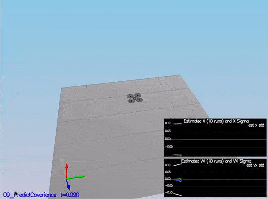
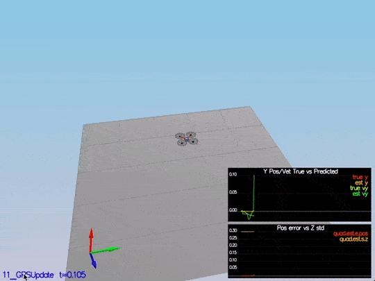

# FCND Estimator-p4
Udacity Project 4 Estimator with updated control Params
The EKF is a very small part of the code base here. Most of the code provided is the drone simulator. The code is the /src directory, and the following are the files where the main files we need to change:

    * /config/QuadEstimatorEKF.txt: This file contains the parameters for tuning the EKF. 
	* /config/QuadControlParams.txt: It contains our beloved parameters for the control code.
    * /src/QuadEstimatorEKF.cpp: This is the EKF implementation.
    * /src/QuadControl.cpp: This is the cascade PID control implemented on the last project.
    


For easy navigation throughout this document, here is an outline:

 - [Development environment setup](#development-environment-setup)
 - [Simulator walkthrough](#simulator-walkthrough)
 - [Tasks](#tasks)


## Development Environment Setup ##

Regardless of your development platform, the first step is to download or clone this repository.

Once you have the code for the simulator, you will need to install the necessary compiler and IDE necessary for running the simulator.

Here are the setup and install instructions for each of the recommended IDEs for each different OS options:

### Windows ###

For Windows, the recommended IDE is Visual Studio.  Here are the steps required for getting the project up and running using Visual Studio.

1. Download and install [Visual Studio](https://www.visualstudio.com/vs/community/)
2. Select *Open Project / Solution* and open `<simulator>/Simulator.sln`
3. From the *Project* menu, select the *Retarget solution* option and select the Windows SDK that is installed on your computer (this should have been installed when installing Visual Studio or upon opening of the project).
4. To compile and run the project / simulator, simply click on the green play button at the top of the screen.  When you run the simulator, you should see a single quadcopter, falling down.


### OS X ###

For Mac OS X, the recommended IDE is XCode, which you can get via the App Store.

1. Download and install XCode from the App Store if you don't already have it installed.
2. Open the project from the `<simulator>/project` directory.
3. After opening project, you need to set the working directory:
  1. Go to *(Project Name)* | *Edit Scheme*
  2. In new window, under *Run/Debug* on left side, under the *Options* tab, set Working Directory to `$PROJECT_DIR` and check ‘use custom working directory’.
  3. Compile and run the project. You should see a single quadcopter, falling down.


### Linux ###

For Linux, the recommended IDE is QtCreator.

1. Download and install QtCreator.
2. Open the `.pro` file from the `<simulator>/project` directory.
3. Compile and run the project (using the tab `Build` select the `qmake` option.  You should see a single quadcopter, falling down.


## Simulator walkthrough ##

### Project Setup ###

This project will continue to use the C++ development environment you set up in the Controls C++ project.

* Clone the repository
```
git clone https://github.com/udacity/FCND-Estimation-CPP.git
```
* Import the code into your IDE like done in the Controls C++ project

* You should now be able to compile and run the estimation simulator just as you did in the controls project


## Run the code ##
The project consists of six scenarios where most of the missing parts of the EKF needs to be implemented and tested.

## Tasks ##
### Step 1: Sensor noise ###

It is step 1 here, but this code contains all the code from the control project as well; so, it is scenario 06_SensorNoise. The simulator will generate two files with GPS and IMU measurements. The task is to process those files and calculate the standard deviation(sigma) for those sensors.<br/>


This video is [06_noise.mp4](./videos/06_noise.mp4). When the scenario is passing the test, you should see this line on the standard output:
```
PASS: ABS(Quad.GPS.X-Quad.Pos.X) was less than MeasuredStdDev_GPSPosXY for 70% of the time
PASS: ABS(Quad.IMU.AX-0.000000) was less than MeasuredStdDev_AccelXY for 69% of the time
```

### Step 2: Altitude Estimator ###

Task : The improved integration scheme should result in an attitude estimator of < 0.1 rad for each of the Euler angles for a duration of at least 3 seconds during the simulation. The integration scheme should use quaternions to improve performance over the current simple integration scheme.

Approach - In this step, we need to include information from the IMU to the state. There is a few code provided by us there. The only thing we need to do is to integrate ```pqr``` from the gyroscope into the estimated pitch and roll. The implementation provided linear. The following figure illustrates the data we get with that implementation:


We need to implement a non-linear one to get better results. First, we need to find the roll, pitch and yaw derivates using the following equation from the control lectures:


Once we have the derivates, we can multiply them by dt to approximate the integral. The following is a more detail graph after the non-linear integration

This video is [07_attitude.mp4](./videos/07_attitude.mp4). When the scenario is passing the output would produce
```
PASS: ABS(Quad.Est.E.MaxEuler) was less than 0.100000 for at least 3.000000 seconds
```

### Step 3: Prediction step ###

Task : The prediction step should include the state update element (PredictState() function), a correct calculation of the Rgb prime matrix, and a proper update of the state covariance. The acceleration should be accounted for as a command in the calculation of gPrime. The covariance update should follow the classic EKF update equation.


This video is [08_sim.mp4](./videos/08_sim.mp4)

The second part we update the covariance matrix and finish the EKF state using the equations on the Estimation for Quadrotors paper provided by Udacity. The important section is 7.2 Transition Model. The matrixes are big, but it is a matter of being careful when creating them in the code.



### Step 4: Magnetometer update ###

Task: The update should properly include the magnetometer data into the state. Note that the solution should make sure to correctly measure the angle error between the current state and the magnetometer value (error should be the short way around, not the long way).


In this step, we need to update the state with the magnetometer measurement. Without code modifications, we have this data:

To implement the update, we need to use the equations from section 7.3.2 Magnetometer from the Estimation for Quadrotors paper.

You can see there the yaw error decrease, and the sigma remained stable. Here is a scenario video:

This video is [09_sim.mp4](./videos/09_sim.mp4). When the scenario is passing one test need future assistance regarding this problem
```
FAIL: ABS(Quad.Est.E.Yaw) was less than 0.120000 for 7.054035 seconds, which was less than 10.000000 seconds
PASS: ABS(Quad.Est.E.Yaw-0.000000) was less than Quad.Est.S.Yaw for 63% of the time
```

### Step 5: GPS update ###

Task: The estimator should correctly incorporate the GPS information to update the current state estimate.

The last step before to finish the EKF implementation: GPS Update. After eliminating the ideal estimator of the code without any code modification.<br/>


This video is scenario5-wild.mov.

To implement this update, we need to use the equations from section 7.3.1 GPS from the Estimation for Quadrotors paper. After it is implemented.



This video is [10_sim.mp4](./videos/10_sim.mp4). When the scenario is passing the test, you should see this line on the standard output:
```
PASS: ABS(Quad.Est.E.Pos) was less than 1.000000 for at least 20.000000 seconds
```

### Step 6: Controller ###
The last step! You need to put the control and parameters from the last project and see how it behaves in a noisy scenario. I was luc
ky enough not to have to tune the control again. I guess the control parameters were "relaxed" already. After adding both files, we received this data:

```
PASS: ABS(Quad.Est.E.Pos) was less than 1.000000 for at least 20.000000 seconds
```